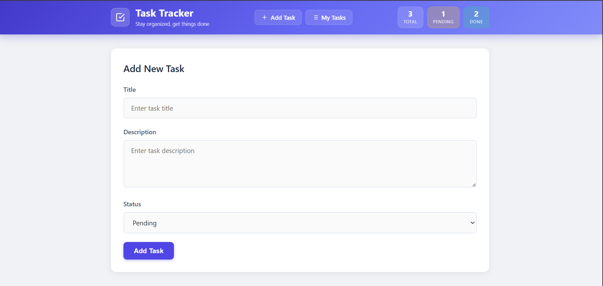
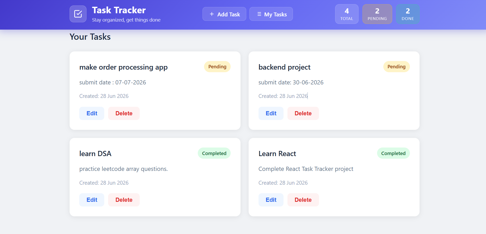

<div align="center">

# 🚀 Task Tracker - MERN Stack

### A modern Full Stack Task Management Web Application

Manage your daily tasks with a clean, responsive, and user-friendly interface built using the **MERN Stack**.


</div>

---

# 🌐 Live Demo

### 🖥 Frontend

**https://task-tracker-orpin-six-64.vercel.app/**

### ⚙ Backend API

**https://task-tracker-backend-7kg3.onrender.com/**

---

# 📖 About The Project

Task Tracker is a Full Stack MERN application that allows users to efficiently manage daily tasks.

Users can:

- ✅ Create Tasks
- 📋 View All Tasks
- ✏ Update Existing Tasks
- 🗑 Delete Tasks
- 📱 Use the application on desktop and mobile devices

The application communicates with a REST API built using Express.js and stores data securely in MongoDB Atlas.

---

# ✨ Features

- CRUD Operations
- REST API Architecture
- MongoDB Database Integration
- Form Validation
- Responsive UI
- Dynamic Updates (No Page Refresh)
- Clean Component Structure
- Error Handling
- Loading States
- Environment Variables
- Production Deployment

---

# 🛠 Tech Stack

## Frontend

- React.js
- Vite
- Axios
- CSS3

## Backend

- Node.js
- Express.js
- MongoDB Atlas
- Mongoose
- dotenv
- CORS

---

# 📂 Project Structure

```text
Task_Tracker/
│
├── backend/
│   ├── config/
│   ├── controllers/
│   ├── models/
│   ├── routes/
│   ├── server.js
│   └── package.json
│
├── frontend/
│   ├── public/
│   ├── src/
│   │   ├── components/
│   │   ├── services/
│   │   ├── App.jsx
│   │   └── main.jsx
│   └── package.json
│
└── README.md
```

---

# 🚀 Installation

## Clone Repository

```bash
git clone https://github.com/YOUR_USERNAME/YOUR_REPOSITORY.git
```

## Backend

```bash
cd backend
npm install
npm run dev
```

## Frontend

```bash
cd frontend
npm install
npm run dev
```

---

# ⚙ Environment Variables

## Backend (.env)

```env
PORT=5000

MONGO_URI=Your_MongoDB_Connection_String
```

## Frontend (.env)

```env
VITE_API_URL=http://localhost:5000/api/tasks
```

---

# 📡 REST API Endpoints

| Method | Endpoint | Description |
| ------ | -------- | ----------- |
| GET | /api/tasks | Get All Tasks |
| GET | /api/tasks/:id | Get Task By ID |
| POST | /api/tasks | Create Task |
| PUT | /api/tasks/:id | Update Task |
| DELETE | /api/tasks/:id | Delete Task |

---

# 📱 Responsive Design

✔ Desktop

✔ Tablet

✔ Mobile

---

# 📸 Screenshots

> Add screenshots inside a folder named **screenshots**.

Example:

```text
screenshots/
│
├── Home.png
├── Task.png
└── Edit.png
```

Then display them:

```md
## Home



## Add Task


```

When you have added the images, replace the above example with:

## Home


## Add Task


---

# 🎯 Assignment Requirements Completed

- ✔ MERN Stack
- ✔ React Frontend
- ✔ Express Backend
- ✔ MongoDB Integration
- ✔ CRUD Operations
- ✔ REST APIs
- ✔ Form Validation
- ✔ Responsive UI
- ✔ Dynamic Updates
- ✔ Environment Variables
- ✔ GitHub Repository
- ✔ Backend Deployment (Render)
- ✔ Frontend Deployment (Vercel)

---

# 👩‍💻 Developer

**Shruti Gajjar**

Backend Developer | MERN Stack Developer

GitHub: https://github.com/SHRUTI-GAJJAR

LinkedIn: https://www.linkedin.com/in/shruti-ujeniya-4620b132b/

---

## ⭐ If you like this project, don't forget to give it a Star!